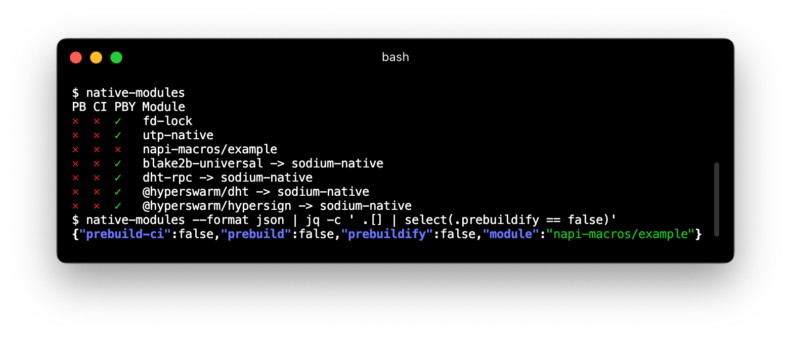

# native-modules

> ℹ️ This package is no longer maintained and all changes have been merged into the upstream project.
>
> 👉 Use [native-modules](https://www.npmjs.com/package/native-modules) instead.
>
> Please update your dependencies to use the upstream package instead.
> 
> This repository will no longer receive updates, bug fixes, or support.

Report on the native node modules used by your application or module.

Checks for presence of [prebuild](https://npmjs.org/package/prebuild), [prebuild-ci](https://npmjs.org/package/prebuild-ci), and [prebuildify](https://github.com/prebuild/prebuildify).



## Usage

```text
 $ native-modules --help
 Usage: native-modules [options]
   --format <string>        The formatting style for command output
                            (formats: pretty|json default: pretty)
   -h, --help               Print command line options
```

## Installation

```bash
$ npm install -g native-modules
```

## License

MIT
